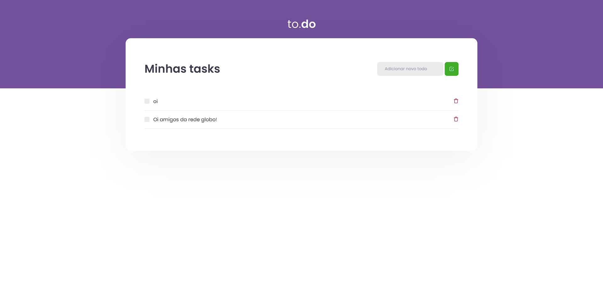

<h1 align="center">
  🔗 ToDo
</h1>

  

---

## Projeto desenvolvido usando <a src="https://pt-br.reactjs.org">ReactJs</a>
- <a src="https://sass-lang.com">Sass</a>
- <a src="https://www.typescriptlang.org">Typescript</a>
- <a src="https://babeljs.io">Babel</a>
- <a src="https://classic.yarnpkg.com/lang/en/">Yarn</a>

---

## 🤝 Contato

Me siga nas redes sociais!

  
  
  

